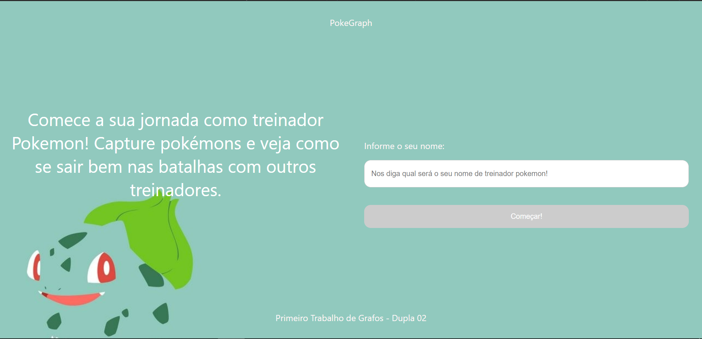
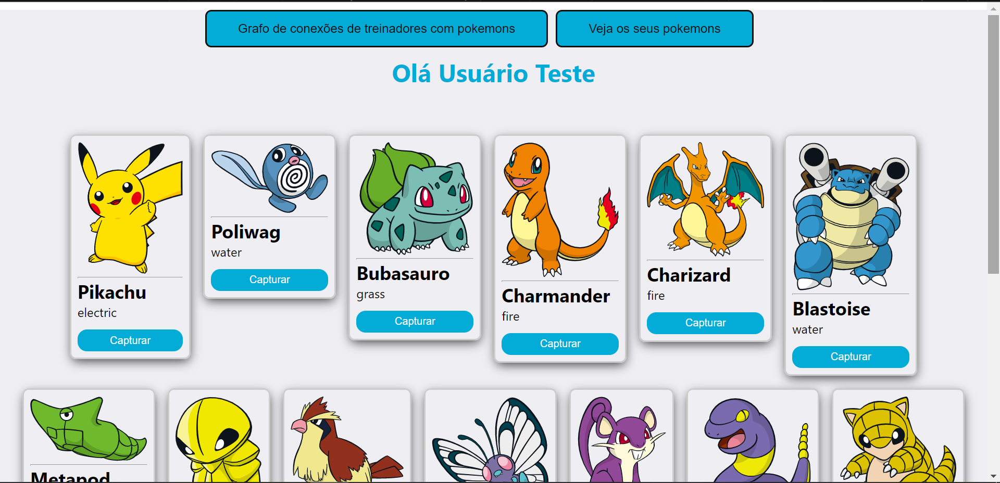
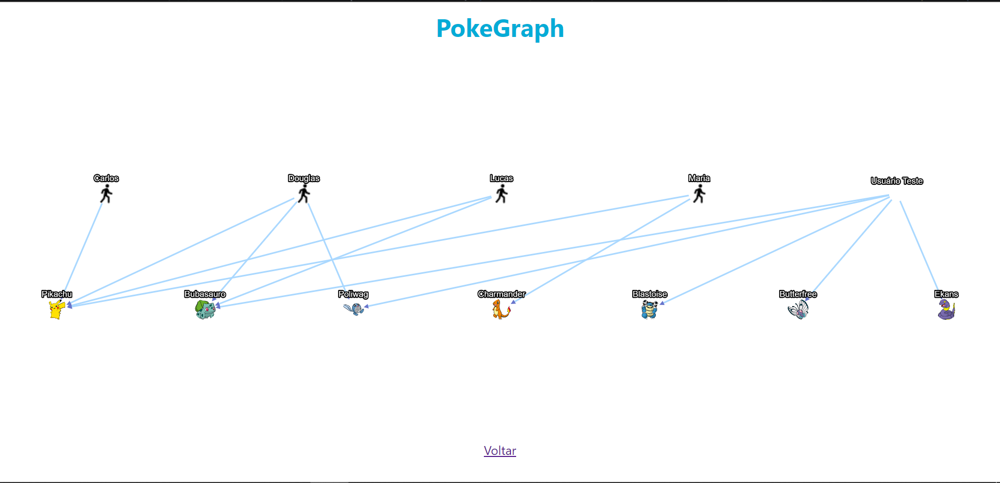
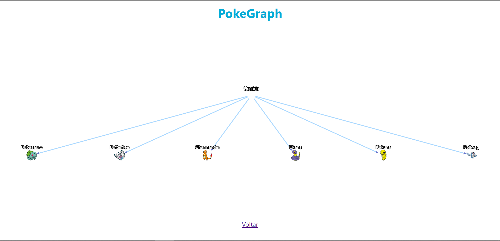

# PokeGraph

**Número da Lista**: undefined<br>
**Conteúdo da Disciplina**: Grafos 1<br>

## Alunos
|Matrícula | Aluno |
| -- | -- |
| 19/0012200  | Douglas da Silva Monteles |
| 17/0016838  |  Lucas Lopes Xavier |

## Sobre 
Este projeto tem como objetivo permitir que treinadores pokémons consigam capturar os pokémons de sua preferência e visualizar tanto a sua conexão com o pokémon capturado quanto a conexão de outros treinadores com este mesmo pokémon. Para isso utilizamos um Grafo direcionado, bipartido e sempre conectado, uma vez que cada treinador pode ter no mínimo um pokémon e só existe conexão entre pokémon e treinador ou entre treinador e pokémon, sendo possível então dividir o grafo em dois conjuntos disjuntos (treinadores e pokémons).

- Um treinador não pode capturar o mesmo pokémon mais de uma vez;
- O grafo sempre será direcionado, treinador em vários pokémons ou pokémon tem vários treinadores;
- O grafo não pode ser desconexo;

Projeto disponível em: <a href="https://pokegraph-projeto-algoritmos.netlify.app">https://pokegraph-projeto-algoritmos.netlify.app</a>

## Screenshots









## Instalação 
**Linguagem**: Javascript (Typescript)<br>
**Framework**: ReactJS<br>

### Pré-requisitos
- Ter no <a href="https://nodejs.org/en/" target="_blank">NodeJS</a> e o <a href="https://www.npmjs.com/" target="_blank">NPM</a> instalados em sua máquina local (Geralmente basta instalar no NodeJS que o NPM é instalado também);

### Baixando e executando o projeto

#### Se preferir, acesse o projeto via navegador pelo link:

<a href="https://pokegraph-projeto-algoritmos.netlify.app">https://pokegraph-projeto-algoritmos.netlify.app</a>

  ```
    git clone https://github.com/projeto-de-algoritmos/Grafos1_PokeGraph.git

    cd Grafos1_PokeGraph
    
    cd frontend

    npm install

    npm start    
  ```

- Do seu navegador, acesse <a href="http://localhost:3000">http://localhost:3000</a>

## Uso 
Na página inicial, informe o seu nome de treinador pokémon e em seguida comece capturando os pokémons e sempre que desejar, visualize o grafo de conexão entre treinadores e pokémons.

## Outros 
Quaisquer outras informações sobre seu projeto podem ser descritas abaixo.


